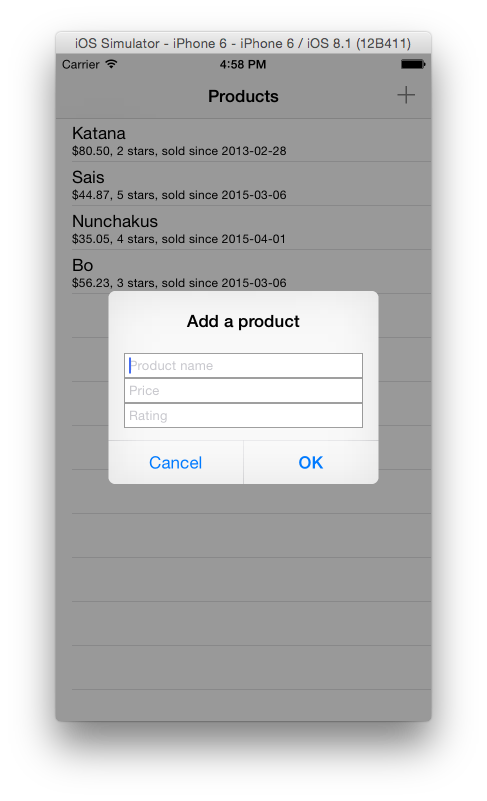

footer: © Feihong Hsu, 2015
slidenumbers: true

# Using Realm with Swift

## CocoaHeads

### March 10, 2015

### Feihong Hsu

### github.com/feihong


---

# What is Realm?

Realm is a mobile database for iOS and Android. On iOS, it's meant to be a replacement for Core Data, offering a similar API but with better performance and a smaller footprint.


---

# Installing in your project

Three methods:

- CocoaPods
- Carthage
- Manual installation (supports iOS 8 dynamic frameworks)

^ Manual installation and installation via Carthage are both pretty simple, but CocoaPods installation isn't quite straightforward yet.

---

# Installing to a Swift project using CocoaPods

The latest stable release of CocoaPods doesn't support Swift packages, so you need to install the prelease version:


```
gem install cocoapods --pre
```

^ Source: http://blog.cocoapods.org/Pod-Authors-Guide-to-CocoaPods-Frameworks/

---

# Installing to a Swift project using CocoaPods

In your Podfile, you should force the Realm pod to be installed as a framework:

```ruby
platform :ios, '8.0'
use_frameworks!
pod 'Realm'
```

^ Source: https://groups.google.com/forum/#!topic/realm-cocoa/_fpQzHw6bxA

---

# Installing to a Swift project using CocoaPods (2)

If you don't add `use_frameworks!`, you must create a bridging header for Realm.

You also need to add the `RLMSupport.swift` file into your project.

^ The `RLMSupport.swift` file contains class extensions for RLMObject, RLMArray, and RLMResults. It cannot be found in the Pods directory. It can be dragged into your project from the `Swift` directory of the Realm download, or you can get it directly from [Github](http://github.com/realm/realm-cocoa/Swift/RLMSupport.swift). It may seem weird that a separate Swift source file is needed in addition to the actual framework, but it is part of their effort to maintain support for iOS 7. See http://realm.io/news/realm-0.85.0/.

---

## Realm has a snazzy database browser


^ You can use it to inspect and edit your database outside of your app.

---

# Loading your Realm database in the browser

To find the location of your Realm database file, run this code in your program:

```swift
println(RLMRealm.defaultRealm().path)
```

In Finder, choose `Go > Go to Folder...` and paste the path into the dialog.

---

# Creating a model

Just subclass RLMObject:

```swift
class Product: RLMObject {
    dynamic var name = ""
    dynamic var price = 0.0
    dynamic var rating = -1
    dynamic var startDate = NSDate(timeIntervalSince1970: 0)
}
```

---

# Limitation: incomplete support for optionals

This does NOT work:

```swift
class Product: RLMObject {
    // ...
    dynamic var startDate: NSDate?
}
```

One possible workaround is to wrap an object inside an RLMObject.

^ Note that the above compiles, but it will cause your program to crash when you try to run it.

---

# Wrapping an object inside RLMObject

You can define a DateBox class that subclasses RLMObject and has a single property of type NSDate:

```swift
class DateBox: RLMObject {
    dynamic var value = NSDate(timeIntervalSince1970: 0)
}
```

---

# Wrapping an object inside RLMObject (2)

Now you can do this:

```swift
class Product: RLMObject {
    // ...
    dynamic var startDate: DateBox?
}
```

---

# Gotcha: Custom initializers for RLMObject subclasses

If you want to make a custom initializer you'll first need to add this annoying boilerplate to your class definition:

```swift
override init() {
    super.init()
}
override init(object: AnyObject!) {
    super.init(object:object)
};
override init(object: AnyObject!, schema: RLMSchema!) {
    super.init(object: object, schema: schema)
}
override init(objectSchema: RLMObjectSchema) {
    super.init(objectSchema: objectSchema)
}
```

^ Source: https://github.com/realm/realm-cocoa/issues/1101

---

## Adding objects to the database

```swift
// Using an Array:
Product.createInRealm(realm, withObject: 
    ["Sais", 44.87, 5, NSDate()])

// Using a Dictionary:
Product.createInDefaultRealmWithObject(
    ["name": "Sais", "price": 44.87, "rating": 5, "startDate": NSDate()])

// Using a custom initializer:
realm.addObject(Product(
    name: "Sais", price: 44.87, rating: 5, startDate: "2013-02-28"))
```

^ If you use an Array to add an object, take care to order the values according to the order in which the corresponding properties were defined.

---

# All writes to the database must be inside a transaction

```swift
realm.beginWriteTransaction()
// write some data
realm.commitWriteTransaction()
```

```swift
realm.transactionBlock {
    // write some data
}
```

---

## Gotcha: one-liners in [RLMRealm transactionBlock:]

You might need to add a return statement inside the closure:

```swift
RLMRealm.defaultRealm().transactionWithBlock {
    Product.createInDefaultRealmWithObject(
        [name, 0.0, 3, NSDate()])
    return
}
```

^ In this case, it's because `[RLMRealm transactionBlock:]` expects the closure to return `Void`, but `[Product createInDefaultRealmWithObject:]` instead returns `Product!`.

^ It's also possible to solve this problem by changing the line to `let _ = Product.createInDefaultRealmWithObject([name, 0.0, 3, NSDate()])`. However, I don't think that is a very clean solution.

---

## Subscribing to database changes

```
let realm = RLMRealm.defaultRealm()
self.notificationToken = realm.addNotificationBlock {
    notification, realm in
    self.tableView.reloadData()
}
```

---

# Notifications

- There's no way to be notified of a particular type of database write.
- The notification is automatically deleted whenever the notification token goes out of scope. For this reason, you'll often want to make the notification token object a property of your view controller.

^ From the Realm website: "[It] is not currently possible to determine what was added/removed/moved/updated... We will be adding this feature in the near future."

---

# Gotcha: retain cyles in [RLMRealm addNotificationBlock:]

```swift
let realm = RLMRealm.defaultRealm()
self.notificationToken = realm.addNotificationBlock {
    [unowned self]      // avoid retain cycle
    notification, realm in
    self.tableView.reloadData()
}
```

^ In this case, the view controller (self) owns the notification token, which owns the closure, which would otherwise own self if you hadn't marked it as unowned.

---

# Pros

- Free, even for commercial projects
- Simpler API than Core Data
- Open source (partly)
- Nice database browser

^ The core C++ storage engine will also be open sourced in future.

---

# Cons

- Still beta (currently at version 0.90.6)
- Swift API is a work-in-progress
- Support for optionals is not great
- No fine-grained notifications (also no support for KVO)

^ Better support for optionals is a priority for the Realm developers: https://github.com/realm/realm-cocoa/issues/628.

---

# HelloRealm demo app

http://github.com/feihong/HelloRealm

---





^ Screenshots of the app.

---

# Conclusion

Realm is a bit immature right now as it heads toward its first stable release.

But you should give Realm a try if your app's model isn't too hindered by the current limitations.

# http://realm.io 

---

# Thank you

Slides (including notes) can be viewed at 

## https://github.com/feihong/realm-talk


